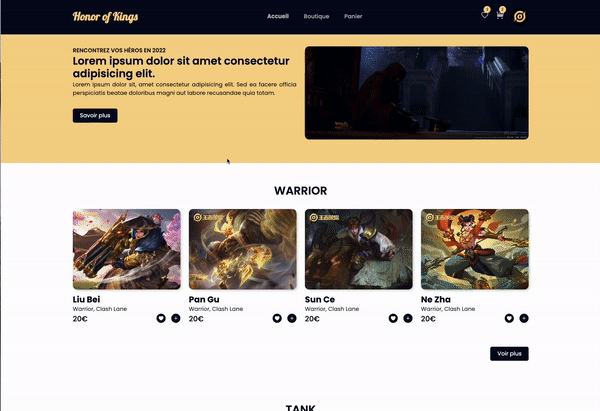

# Honor of Kings

E-commerce website "Honor of Kings"

## Documentation

- [React](https://fr.reactjs.org/)
- [Redux](https://redux.js.org/)
- [React Router](https://v5.reactrouter.com/web/guides/quick-start)
- [Framer Motion](https://www.framer.com/docs/)
- [Remix Icon](https://github.com/Remix-Design/remixicon#usage)
- [Reactstrap](https://reactstrap.github.io/?path=/story/home-installation--page)
- [React-Toastify](https://fkhadra.github.io/react-toastify/introduction)
- [Firebase](https://firebase.google.com/)
- [Prettier](https://prettier.io/docs/en/install.html)

## Demo

